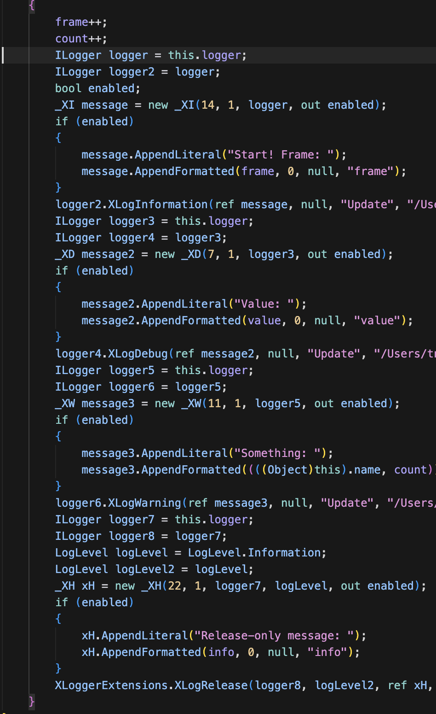
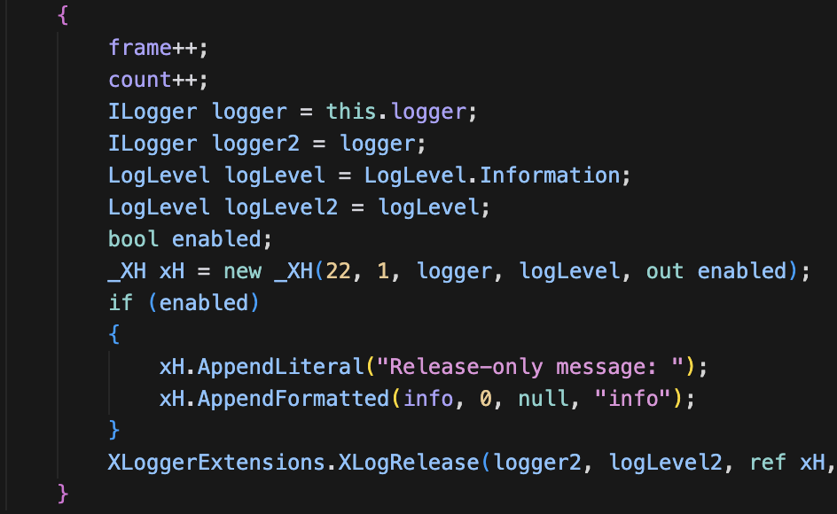

# xpTURN.XLogger

High-performance logging extension package for Unity. Built on [ZLogger](https://github.com/Cysharp/ZLogger), it provides `XLog*` extension methods and uses **scripting define symbols** to completely remove log calls from the build.

ZLogger is widely used for its compiler-transformed interpolated strings and standard `ILogger` integration. It does not, however, offer stripping log call code from distribution builds; this package fills that role.

## Requirements

- **Unity** 2022.3+ (12f1)
- **ZLogger, ZLogger.Unity** 2.5+
- **xpTURN.Polyfill** 0.3.0+ (required for C# 10/11 features, or configure manually)

### xpTURN.Polyfill Installation

<details>
<summary>How to add xpTURN.Polyfill to your project (when not installed or configured)</summary>

To use XLogger (including ZLogger), you need to modify the project settings to use the C# preview language version (e.g. <code>-langversion:preview</code>, adding Polyfill code).

### 1 Install xpTURN.Polyfill

📦 [xpTURN.Polyfill](https://github.com/xpTURN/Polyfill)

1. Open **Window > Package Manager**
2. Click **+** > **Add package from git URL...**

```text
https://github.com/xpTURN/Polyfill.git?path=src/Polyfill/Assets/Polyfill
```

3. ⚙️ Run Edit > Polyfill > Player Settings > `Apply Additional Compiler Arguments -langversion (All Installed Platforms)`

</details>

### ZLogger Installation

<details>
<summary>How to add ZLogger to your project (when not installed)</summary>

### 1 Install NuGetForUnity

📦 [NuGetForUnity](https://github.com/GlitchEnzo/NuGetForUnity)

1. Open **Window > Package Manager**
2. Click **+** > **Add package from git URL...**

```text
https://github.com/GlitchEnzo/NuGetForUnity.git?path=/src/NuGetForUnity
```

### 2 Install ZLogger

📦 [ZLogger](https://github.com/Cysharp/ZLogger)

1. Open **NuGet > Manage NuGet Packages**
2. Click **🔍️**, enter **ZLogger**, then click **Search**
3. Find **ZLogger by Cysharp** and click **Install**

### 3 Install ZLogger.Unity (Unity-specific extension)

1. Open **Window > Package Manager**
2. Click **+** > **Add package from git URL...**
3. Enter:

```text
https://github.com/Cysharp/ZLogger.git?path=src/ZLogger.Unity/Assets/ZLogger.Unity
```

</details>

## xpTURN.XLogger – Installation

1. Open **Window > Package Manager**
2. Click **+** > **Add package from git URL...**

```text
https://github.com/xpTURN/XLogger.git?path=src/XLogger/Assets/XLogger
```

### ✅ Enabling logging

1. In **Edit → XLogger → Player Settings**, apply the desired define symbol(s).
   - **Apply 'ENABLE_XLOGGER' Define Symbol**  
     Enables all `XLog*` methods. Without this symbol, XLog calls are removed at compile time.
   - **Apply 'ENABLE_XLOGGER_RELEASE' Define Symbol**  
     Use when you want `XLogRelease` output in release builds. Without this symbol, those calls are removed at compile time.

## 💡 Usage

The following extension methods are available on `ILogger`:

| Method | Log level | Conditional compile |
|--------|-----------|----------------------|
| `XLog` | Specified log level | `ENABLE_XLOGGER` |
| `XLogTrace` | Trace | `ENABLE_XLOGGER` |
| `XLogDebug` | Debug | `ENABLE_XLOGGER` |
| `XLogInformation` | Information | `ENABLE_XLOGGER` |
| `XLogWarning` | Warning | `ENABLE_XLOGGER` |
| `XLogError` | Error | `ENABLE_XLOGGER` |
| `XLogCritical` | Critical | `ENABLE_XLOGGER` |
| `XLogRelease` | Specified log level | `ENABLE_XLOGGER_RELEASE` |

- You can use interpolated strings as-is; like ZLogger, **structured logging** and **caller info** (method name, file path, line number) are included.
- ⚠️ Note: Conditional compilation does not apply when using Log* or ZLog* instead of the XLog* methods.

```csharp
using Microsoft.Extensions.Logging;
using ILogger = Microsoft.Extensions.Logging.ILogger;

using ZLogger;
using ZLogger.Unity;
using UnityEngine;

public class SimpleLogger : MonoBehaviour
{
    ILogger logger;

    int frame = 0;
    int count = 0;
    long value = 1000;
    string info = "MyGame";

    void Awake()
    {
        // LoggerFactory setup (same as ZLogger)
        var loggerFactory = LoggerFactory.Create(logging =>
        {
            logging.SetMinimumLevel(LogLevel.Trace);
            logging.AddZLoggerUnityDebug();
        });

        logger = loggerFactory.CreateLogger("MyCategory");
    }

    void Update()
    {
        ++frame;
        ++count;
        // If ENABLE_XLOGGER is not defined, the following calls are not included in the build output
        logger.XLogInformation($"Start! Frame: {frame}");
        logger.XLogDebug($"Value: {value}");
        logger.XLogWarning($"Something: {(name, count)}"); // named

        // Output only when ENABLE_XLOGGER_RELEASE is defined
        logger.XLogRelease(LogLevel.Information, $"Release-only message: {info}");
    }
}
```

## Scripting define symbols

- **ENABLE_XLOGGER**
  Enables all `XLog*` calls (except XLogRelease). If removed, those calls are eliminated at compile time with no runtime cost.
- **ENABLE_XLOGGER_RELEASE**
  Enables only `XLogRelease`. Use when you want to disable debug XLog and keep only the messages needed in release.

You can add or remove symbols per platform under **Edit → XLogger → Player Settings**.

### IL output example

#### **ENABLE_XLOGGER** enabled



- Both debug and release log code are present in the build.

#### **ENABLE_XLOGGER** disabled



- Only release log code remains.

## License

See [LICENSE](https://github.com/xpTURN/XLogger/blob/main/LICENSE.md).

## Links

- [Changelog](https://github.com/xpTURN/XLogger/blob/main/CHANGELOG.md)
- [xpTURN](https://github.com/xpTURN)
